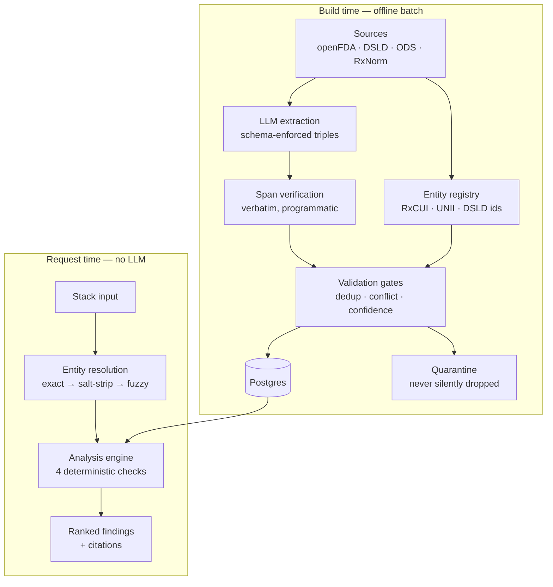

# Supplement Stack Analyzer

Finds interactions, redundancies, upper-limit breaches, and timing conflicts across
everything a person takes — supplements **and** prescriptions.

**Try it:** [supplement-stack-analyzer-opal.vercel.app](https://supplement-stack-analyzer-opal.vercel.app) — paste a stack, get cited findings.

Most people who take supplements take several at once, often alongside medication,
with no check on whether those compounds fight each other. The failure modes are
concrete: St. John's Wort induces CYP3A4 and defeats SSRIs and statins; magnesium
chelates fluoroquinolone antibiotics; a multivitamin plus a B-complex plus a separate
B12 stacks the same ingredient three ways past a real toxicity ceiling. The only
reliable check today is a pharmacist, and most people never ask one.

---

## Why this is buildable now

**The NLM discontinued its free Drug Interaction API in January 2024**, with no
replacement. RxNorm name normalization survives; the interaction endpoints are gone,
and that data now sits behind DrugBank and Natural Medicines — both commercial.

The *primary sources*, however, are all still free and public:

| Source | Provides |
|---|---|
| [openFDA](https://open.fda.gov/) | Structured product labels, including free-text "Drug Interactions" sections |
| [NIH DSLD](https://dsld.od.nih.gov/) | 207,000+ dietary supplement labels with ingredient breakdowns |
| [NIH ODS](https://ods.od.nih.gov/) | Per-nutrient monographs and tolerable upper intake levels |
| [RxNorm / RxNav](https://rxnav.nlm.nih.gov/) | Drug name normalization, RxCUI identifiers |

So the structured, free supplement–drug interaction layer no longer exists — which is
why every free checker out there is thin. Rebuilding that layer by extracting it from
primary sources is the actual product.

---

## The rule the whole design rests on

> **The LLM never decides whether an interaction exists.**

It does exactly two jobs: parse messy input into normalized compounds, and turn an
already-retrieved fact into readable prose. Interaction **detection** is a
deterministic database lookup.

That single constraint buys three things at once:

- **Auditability.** Every stored claim carries a verbatim source span, verified
  programmatically before storage. No span, no triple — enforced at the gate, not by
  convention.
- **Cost.** The expensive model work happens offline in batch. A user request costs
  a database query.
- **Substance.** This is a retrieval and data-engineering system, not a chatbot with
  a system prompt.

---

## Architecture



The analysis engine runs four independent checks: **pairwise** interaction lookup,
**redundancy** across products, **cumulative dose** against upper intake limits, and
**timing** separation rules.

---

## Design decisions, and why

**Interaction detection is a lookup, never a generation.** Pure runtime RAG was
considered and rejected. Its failure mode is a *silent miss* — retrieval comes back
empty and the tool reports a confident all-clear. That is the worst possible outcome
for a safety tool, and it is invisible in testing.

**The system never says "you are safe."** It says *"no known interactions among the N
compounds we could identify."* Those are different claims, and the difference is the
entire ethical and legal posture of the product.

**Units are never converted.** If a dose is reported in mcg and the published limit is
in mg, the check is skipped and reported as unassessed. A wrong mcg↔IU conversion
would produce a false all-clear on a toxicity ceiling — worse than no answer.

**The checks never go silent.** An entity whose doses can't all be measured is still
assessed on the part that can be. If the measurable portion alone exceeds the ceiling,
that's a certain breach regardless of the rest. Otherwise the user is told the check
was incomplete, because silence reads as an all-clear.

**Confidence measures corroboration, not repetition.** Corroboration requires new
span *content*, not merely a new URL. Deduplicating by URL alone is not enough:
generic drugs carry the same FDA-mandated wording under every manufacturer's label
id, so one sentence reaches the pipeline under five distinct URLs. Counting those
as five independent sources would be self-corroboration in disguise — in the very
number used to rank findings by trustworthiness.

**Ambiguity is surfaced, never guessed.** `"Vitamin B"` doesn't resolve to anything and
doesn't pretend to. Two entities sharing an alias return `Ambiguous` with both
candidates rather than silently picking one. `ALA` is deliberately absent from the
abbreviation table — it means alpha-*lipoic* acid or alpha-*linolenic* acid depending
on context, and picking one would be a guess.

**Human review decisions are not overridden.** An interaction a reviewer marked
`REJECTED` stays rejected even when a later, higher-severity source arrives. Evidence
still accrues so the call can be revisited deliberately.

---

## Status — measured, not claimed

**The system runs end to end on real data.** Six FDA drugs ingested (levothyroxine,
warfarin, atorvastatin, omeprazole, ciprofloxacin, alendronate) plus a curated
supplement registry: **149 entities, 631 aliases, 124 interactions, 214 evidence
rows**, every one with a live citation. 193 tests.

| Graph, 2026-09-29 | |
|---|---|
| Published | 122 (5 contraindicated, 38 major, 63 moderate, 15 minor, 1 theoretical) |
| Rejected at review | 2 |
| With a supplement or food on one side | 20 (warfarin + vitamin K / ginkgo / garlic / CoQ10 / St John's Wort, sertraline + St John's Wort / tryptophan, calcium + alendronate, ...) |
| Quarantined, not guessed | 266, mostly drug-class terms ("NSAIDs", "CYP3A4 inhibitors") |

**Who reviewed it.** Every interaction was reviewed against its verbatim FDA quote by
Claude, acting on the author's delegation. That is recorded on each row
(`reviewed_by`, `reviewed_at`, `review_note`, and the original value of any corrected
field), and the decision files are in [`data/reviews/`](data/reviews/). It is a careful
review, **not a clinical one**. A pharmacist review of the major and contraindicated
rows comes before any clinical use.

### Entity resolution, measured on text we did not write

| Run | Result |
|---|---|
| Hand-written gold set, 143 cases incl. 22 must-not-resolve | 100%, 0 wrong |
| Held-out: 105 ingredient names from real NIH DSLD labels | 50 resolved, **0 wrong**, ~86% recall on names the registry holds |

The gold set was expanded from 21 to 139 cases *before* the resolver was changed, and
scored 38.8% with 11 wrong answers at that point. The held-out run matters more than the
100%, because it caught what the gold set missed: `Vitamin B1` resolving to vitamin K
(fuzzy score 90 against "vitamin k1"). Numbers and one- or two-letter tokens are now
identity, never spelling. A drug can never win a fuzzy match (escitalopram scored 91
against citalopram), and a brand is accepted only if its ingredients are exactly one
drug (RxNorm lists Caduet, which is atorvastatin plus amlodipine, as an atorvastatin
brand). Details: [`evals/HELDOUT.md`](evals/HELDOUT.md).

### What the first real ingestion measured

| Metric | Result | What it means |
|---|---|---|
| Span verification | **172 / 173 (99.4%)** | The model quotes source text almost perfectly |
| Conflict records | **92** across 38 interactions | The model contradicts *itself* on judgment fields |
| — by field | evidence grade 49, severity 22, direction 21 | Evidence grade is the least stable judgment |
| Held for human review | 29 of 38 | Everything moderate-or-above, by design |

Those first two rows are the point. Reading four sections of one drug's label, the
model transcribes near-perfectly and disagrees with itself constantly about
severity and evidence strength. **That is the empirical case for the whole
architecture**: trust the model for transcription, never for judgment. Detection
is a database lookup; every consequential claim goes to a person.

### Extraction model, chosen by measurement

Measured on one real FDA section, all with 100% span verification:

| Model | Triples | Cost | 200-drug build-out |
|---|---|---|---|
| Opus 5 | 49 | $0.27 | ~$190 |
| Sonnet 5 (effort low) | 31 | $0.061 | ~$43 |
| **Haiku 4.5** ← chosen | **51** | **$0.039** | **~$27** |

Haiku found more interactions than Opus at a seventh of the cost. That was the
opposite of the prediction; it is why the choice was measured rather than argued.

Extraction is a one-time capital cost. Once a document is processed the graph
serves unlimited users at essentially zero marginal cost, because request time is
a Postgres lookup with no model in it.

### Not built yet

Recall against an independent, labelled interaction gold set is the metric that would
justify a coverage claim, and that set does not exist yet. **No recall number is claimed
here, and none should be inferred.** Also outstanding: exact vitamin D IU-to-mcg
conversion for the upper-limit check, drug classes as entities (they account for most
of the quarantine), branded product expansion in the request path, an LLM parser for
messy input.

## Setup

```bash
python -m venv .venv && .venv/Scripts/activate
pip install -e ".[dev]"
cp .env.example .env    # then fill in DATABASE_URL and ANTHROPIC_API_KEY
alembic upgrade head
```

`DATABASE_URL` must name the driver explicitly — `postgresql+psycopg://...`, not
`postgresql://...`.

## Usage

```bash
ssa init-db                                      # create schema (or: alembic upgrade head)
ssa seed                                         # upper limits, synonyms, curated supplements
ssa ingest levothyroxine                         # extract interactions from openFDA labels
ssa enrich                                       # add RxNorm brand and salt names
ssa replay                                       # retry quarantined triples, offline
ssa review list                                  # interactions awaiting a decision
ssa analyze "Zoloft 50mg, St Johns Wort 300mg"   # analyze a stack
```

`ssa ingest` calls the Anthropic API and costs money. Nothing else does.

Example output:

```
2 findings across 1 identified compound, from 2 entries entered.

[MAJOR] Vitamin B6 exceeds its tolerable upper intake level
  Your total Vitamin B6 intake is 120 mg per day from Vitamin B6 x2, above the
  published adult upper limit of 100 mg. Chronic intake above this level is
  associated with peripheral neuropathy.
  source: https://ods.od.nih.gov/factsheets/VitaminB6-HealthProfessional/

[MINOR] Vitamin B6 appears more than once
  Vitamin B6 appears in 2 products (Vitamin B6 x2), totalling 120 mg per day.

This tool reports published information for education. It is not medical advice
and does not replace a pharmacist or physician.
```

## The public checker

`site/` is the deployed checker: a static page and one Python function on Vercel. The
deployment never touches the production database. `scripts/build_site.py` exports only
**published** interactions to a JSON snapshot that ships inside the function and loads into
in-memory SQLite, so no credential is deployed and nothing pending review can leak.

```bash
python scripts/build_site.py      # snapshot + page (numbers filled from the data)
python scripts/serve_site.py      # local, same headers as production
cd site && vercel deploy --prod
```

Security: strict CSP (no inline script or style), HSTS, framing denied, DOM built with
`textContent` only, citation links allowlisted on both sides, same-origin + JSON-only +
size caps + rate limit on the API, no request logging.

## Tests

```bash
pytest -v && ruff check src tests evals
```

207 tests. No test makes a network call or an API call — HTTP is mocked with
`responses`, the Anthropic client with `MagicMock`. Tests run against in-memory
SQLite; production is Postgres, and all column types are kept portable.

---

## Stack

Python 3.11+ · SQLAlchemy 2 · Alembic · Postgres (Neon) · Pydantic v2 ·
Anthropic SDK (`claude-haiku-4-5` for extraction) · pytest · ruff

---

## Not medical advice

This is an educational information tool. It reports published findings with citations
and does not make patient-specific treatment recommendations. It does not replace a
pharmacist or physician.
